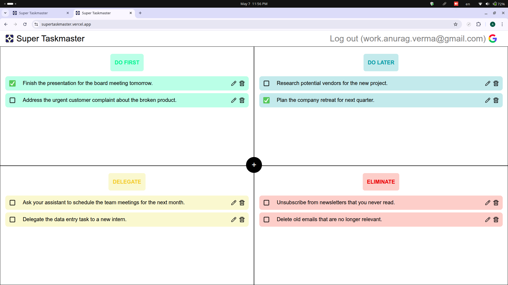
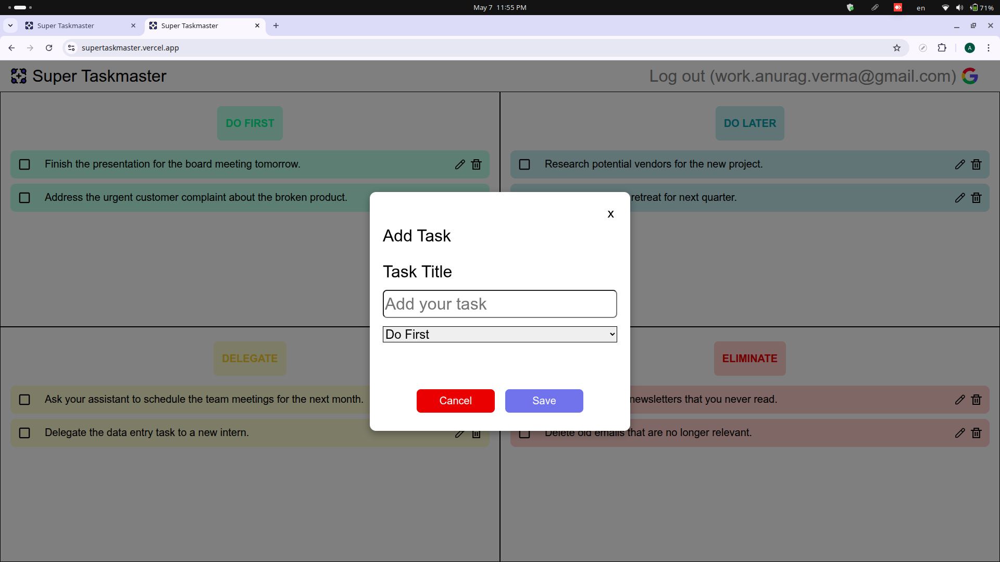
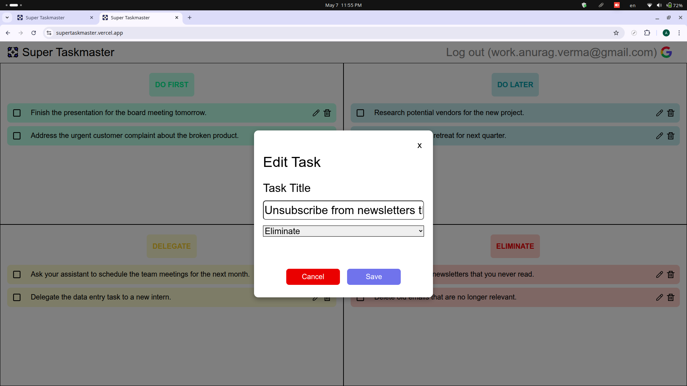

# Super Taskmaster

Super Taskmaster is a task management app with real time cloud sync.
It's based on the concept of the Eisenhower Matrix.

The deployment can be found in the following two places:

-   [Vercel](https://supertaskmaster.vercel.app/)
-   [Netlify](https://supertaskmaster.netlify.app/)

## Technologies used

- [**React JS**](https://react.dev/)
- [**Firebase**](https://firebase.google.com/) - Realtime Database
- [Vite](https://vite.dev/)
- [Modern CSS](https://developer.mozilla.org/en-US/docs/Web/CSS/CSS_flexible_box_layout/Typical_use_cases_of_flexbox)

## Screenshots

#### References

Here is the quote from 34th US President Dwight D. Eisenhower that inspired the concept of the Eisenhower matrix

> I have two kinds of problems, the urgent and the important. The urgent are not important, and the important are never urgent

Here is a link to the source of the quote: [Dwight D. Eisenhower's Address at the Second Assembly of the World Council of Churches, Evanston, Illinois](https://www.presidency.ucsb.edu/documents/address-the-second-assembly-the-world-council-churches-evanston-illinois)

Full Link https://www.presidency.ucsb.edu/documents/address-the-second-assembly-the-world-council-churches-evanston-illinois
